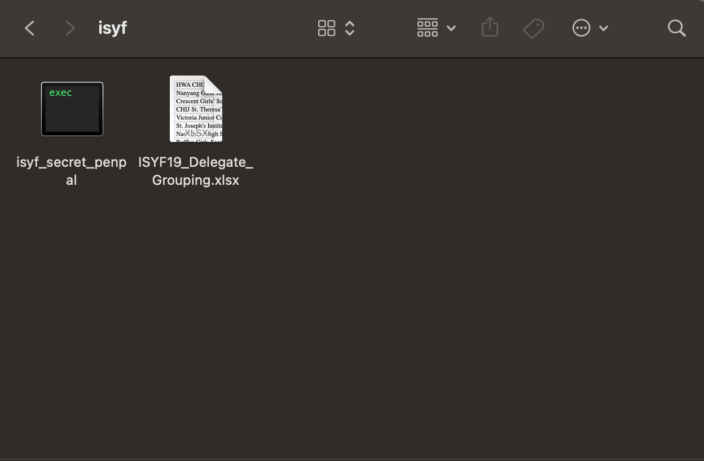
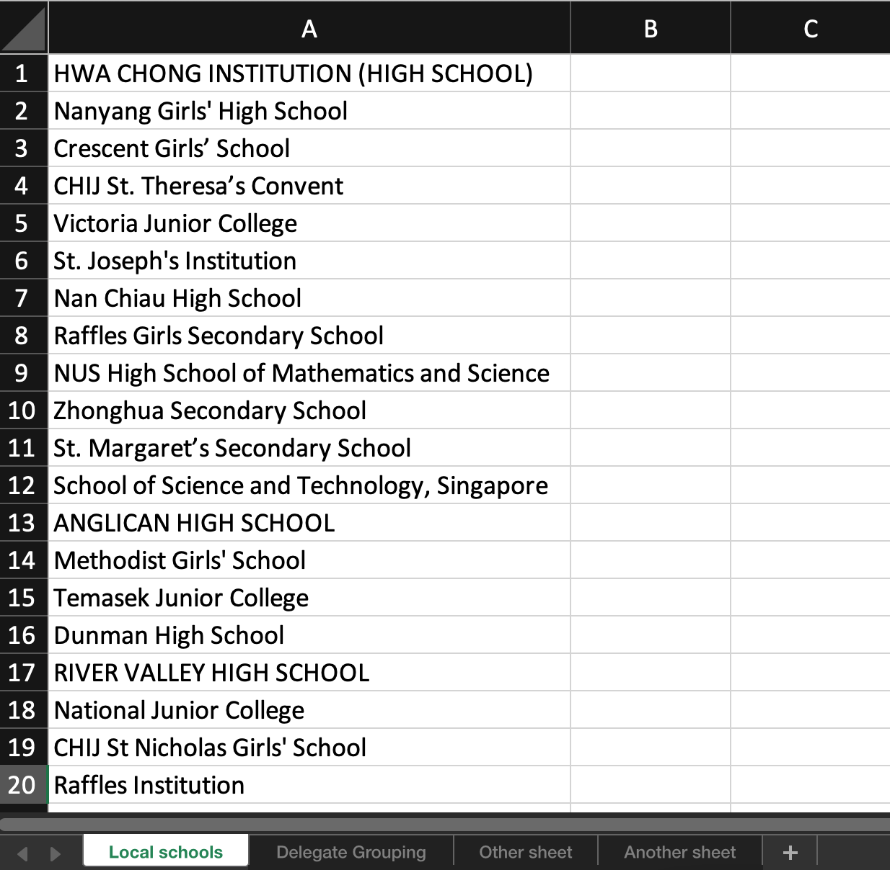
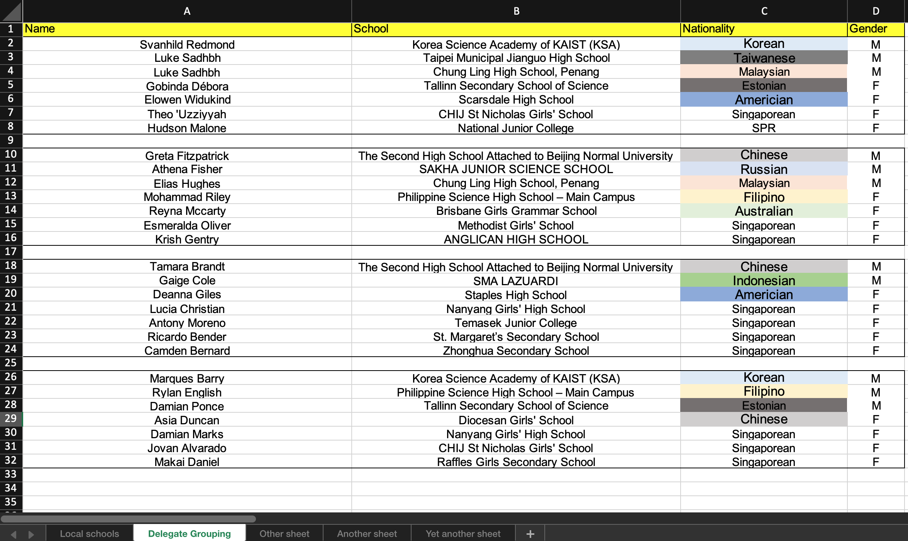

# ISYF Secret Penpal

## Python program to allocate pairs for the Secret Penpal activity

Secret penpal is an activity where each participant will be writing to another participant whose identity will be unknown to them. Each pair will write to each other about their experience at the end of each day of the event. The identity of one's penpal will only be revealed at the end of the event. 

Participants will be paired up according to these criteria: 
- Both participants are from different **groups** 
- Both participants are from different **schools**
- Foreign students will **always** be paired with locals 

This is to promote culture appreciation among the participants and reduce the chances for participants to find their penpal during the events before the reveal.

Note: This program is written for the Secret Penpal activity conducted during the International Science Youth Forum (ISYF). 

## Download
For `Windows`, please download the executable file `isyf_secret_penpal_windows` in the `windows` folder. Click on the program to run.

For `Mac`, please download the executable file `isyf_secret_penpal_mac` in the `mac` folder. 

- Open a `terminal` instance and navigate into the folder with the downloaded file using the `cd` command. It will most probably be in the downloads folder.

```bash
cd Downloads/
```

-  Next, make the file into an Unix executable file for it to run by using the `chmod 755` command followed by the name of the file.

```bash
chmod 755 isyf_secret_penpal_mac
```

- **Control-click** or **Right-click** the executable file and select `Open`. 
- Select `Open` again on the confirmation prompt to run the file.

## How to use
Ensure that the input excel sheet is in the **SAME FOLDER** as the program so that it can find it!

<div align="center">

</div>

For the program to interpret the participants information correctly, please follow the format as shown below strictly.

1. The **1<sup>st</sup> sheet** in the input file should contain all **LOCAL** schools. It should start at the top right cell. Please do NOT include other information other than local schools in the first column.

<div align="center">

</div>

2. The **2<sup>nd</sup> sheet** should contain the delegates information in their respective groups.

| Name | School | Nationality | Gender |
| :--: | :----: | :---------: | :----: |
| Tom  | ABC School | Singaporean | M  |

1. The **1<sup>st</sup> ROW** contains the **headers** (Name, School, Nationality, Gender). This row of information will be ignored by the program

2. **1<sup>st</sup> COLUMN**: *Name* of participant
3. **2<sup>nd</sup> COLUMN**: *School* of participant
4. **3<sup>rd</sup> COLUMN**: *Nationality* of participant
5. **4<sup>th</sup> COLUMN**: *Gender* of participant

> **Important**: Leave an **EMPTY ROW** between participants of **different** groups. This is for the program to identify the groupings



3. Any other sheets should be placed **BEHIND** the first two abovementioned sheets. These additional sheets will be ignored by the program.


4. Ensure that the input excel sheet is in the **SAME FOLDER** as the program. Next, input the name of the excel sheet (without `.xlsx`)

5. Lastly, input the **number of participants** and **number of groups** in the event for verification purposes.

## Results
This program will generate a new excel file called `pairing_results.xls`. It will contain the allocated pairs and consists of the following sheets:

- **Delegates**: All the participants information and their corresponding group number.
- **Pairs**: Each pair will be shown on each row with one participant on the right and the other on the left.
- **Grouped**: A list of all participants and their corresponding penpals

If the total number of participants is **odd**, there will be an additional person indicated at the end of program. This person will be need to be **manually added** to an existing pair!

## Troubleshooting
1. Pair cannot be found (Keeps showing the same person)

    - If the output repeatedly shows one participant's name, simply terminate the program and run it again.

2. Incorrect number of groups or participants

    - Likely a **formatting** issue with the input excel sheet. Please ensure it follows the abovementioned formatting requirements.

3. Other issues

    - Contact me at my Telegram handle @zheng_hongg or email me at zhtong@gmail.com for any issues. I will do my best to help! :relaxed:

## Implementation
Since there are more local students than foreign students, this program will prioritise matching foreign students first. When matching a student with another person, another participant will be **randomly** selected. 

The selection criteria as mentioned above will be checked between the two participants. If it is a valid pair, they will be recorded and removed from the pool of participants. Else, anther random student will be selected. 

This matching process repeats until there is either one or no participants left. If the total number of participants is odd, there will be an additional person left. This person will be need to be **manually added** to a pair!

## Find a bug?
If you found an issue or would like to submit an improvement to this project, please submit an issue using the issues tab above. If you would like to submit a PR with a fix, reference the issue you created!